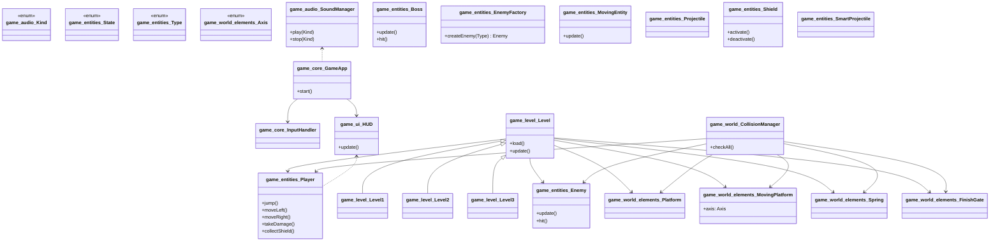
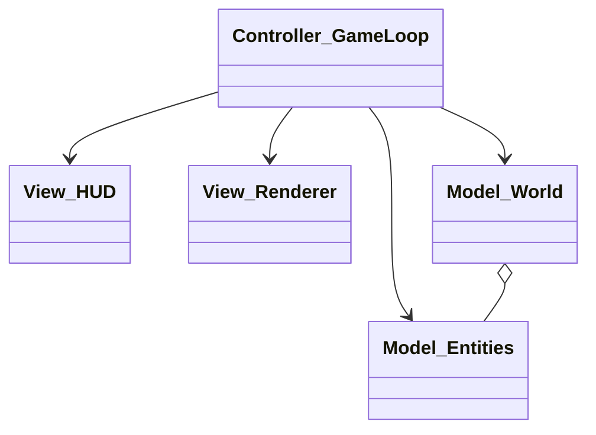

# Relazione di Progetto – SonicX

> **Nota metodologica**: questa relazione segue la struttura richiesta (Analisi → Design → Sviluppo → Guida utente → Commenti finali), mantenendo la netta separazione tra **analisi** (cosa il sistema deve fare) e **progetto/implementazione** (come il sistema lo fa). Il tono è in **prima persona** perché ho realizzato e documentato il progetto personalmente.

---

## 1. Analisi

### 1.1 Obiettivo e contesto
Voglio realizzare un videogioco 2D a piattaforme ispirato allo stile di *Sonic*, in cui l’utente guida un personaggio attraverso livelli progressivi, evita pericoli, interagisce con elementi del mondo (molle, piattaforme, portali di fine livello) e completa obiettivi. L’applicazione deve essere fruibile da un utente senza conoscenze tecniche, con comandi semplici e feedback visivo/sonoro chiari.

### 1.2 Requisiti (cosa deve fare)
**Requisiti funzionali**
1. Il giocatore può muoversi orizzontalmente e saltare.
2. Il sistema presenta più livelli con ostacoli, piattaforme (anche mobili) ed elementi interattivi (es. molle).
3. Sono presenti nemici con comportamenti diversi e un boss in almeno un livello avanzato.
4. Il gioco termina il livello quando il giocatore raggiunge un traguardo (FinishGate) o esaurisce le vite.
5. L’interfaccia mostra informazioni essenziali: vite, punteggio/tempo, stato del personaggio (es. scudo attivo).
6. Il sistema gestisce l’input da tastiera in modo responsivo (tenere premuto vs. pressione singola).
7. Il sistema fornisce feedback audio/visivo per azioni principali (salto, danno, vittoria, sconfitta).
8. È presente un menu iniziale per avvio partita e uscita.

**Requisiti non funzionali**
1. Esperienza fluida (responsività dei controlli; tempi di risposta percepiti brevi).
2. Organizzazione chiara dei contenuti (livelli progressivi, interazioni coerenti, feedback comprensibili).
3. Robustezza di base (gestione errori comuni, assenza di crash durante il normale uso).
4. Portabilità e facilità di avvio per l’utente finale.

### 1.3 Glossario minimo (termini del dominio)
- **Player**: entità controllata dall’utente.
- **Enemy/Nemico**: entità ostile che può danneggiare il player.
- **Boss**: nemico principale con comportamenti più complessi.
- **Level**: scenario giocabile con obiettivi e fine livello.
- **FinishGate**: traguardo che conclude il livello.
- **Spring**: molla che spinge verso l’alto.
- **MovingPlatform**: piattaforma che si muove lungo un asse.
- **Shield**: protezione temporanea del giocatore.
- **HUD**: sovraimpressione con informazioni utili (vite, tempo, ecc.).

### 1.4 Analisi e modello del dominio (senza soluzioni)
Il problema riguarda la navigazione di un personaggio (Player) in un mondo composto da livelli (Level) popolati da elementi passivi (piattaforme fisse e mobili, molle) e attivi (nemici, boss). Il Player interagisce con l’ambiente secondo regole di gioco (caduta, salto, rimbalzo su molle, raccolta/scudo, danno da nemici). La chiusura del livello avviene al raggiungimento del traguardo. 

Sono **fuori dallo scope** (per questa versione) elementi come: salvataggi persistenti, editor di livelli, multiplayer, IA avanzata dei nemici, ranking online. Tali aspetti potranno essere affrontati in evoluzioni future.

#### 1.4.1 UML del dominio
> Lo schema seguente riporta **le entità e le relazioni concettuali** del dominio (astratte dal dettaglio implementativo). Non mostra scelte tecnologiche né campi/metodi privati non essenziali alla comprensione del problema.

> *Nota*: lo schema è stato compattato per fini espositivi. La versione completa (più estesa) è disponibile nel sorgente del progetto.

---

## 2. Design (come soddisfo i requisiti)

### 2.1 Architettura ad alto livello
A livello architetturale adotto una separazione **MVC semplificata**: 
- **Model:** entità di gioco e regole (Player, Enemy, Boss, Level, CollisionManager, elementi del mondo).  
- **View:** rendering grafico e HUD.  
- **Controller:** ciclo di gioco e gestione input.

L’avvio carica il menu, quindi la selezione conduce al livello, dove il ciclo di gioco coordina: raccolta input → aggiornamento logica → aggiornamento vista.

#### 2.1.1 UML architetturale (mirato)

> Schema intenzionalmente minimale per evidenziare i ruoli e i flussi principali senza dettagli implementativi.

### 2.2 Design dettagliato (selezione di decisioni chiave)

#### A) Gestione degli stati (Pattern **State/Strategy**)
**Problema**: player e boss hanno comportamenti variabili (idle, corsa, salto; fasi del boss).  
**Soluzione**: interfacce di stato con implementazioni intercambiabili; il contesto delega il comportamento allo stato corrente.  
**Motivazione**: estendibilità (aggiungere nuovi stati senza toccare il contesto) e chiarezza delle responsabilità.

#### B) Livelli estendibili (Pattern **Template Method**)
**Problema**: i livelli condividono struttura ma differiscono per layout/nemici.  
**Soluzione**: classe base `Level` con passi fissi e hook per specializzazioni (`spawnEnemies()`, `initPlatforms()`).  
**Motivazione**: riduzione duplicazione e coerenza del flusso di gioco.

#### C) HUD reattivo (Pattern **Observer**)
**Problema**: la UI deve riflettere in tempo reale stato vite/tempo/scudo.  
**Soluzione**: HUD osserva il Player; ad ogni variazione notifica un aggiornamento.  
**Motivazione**: disaccoppiamento tra logica di gioco e presentazione.

#### D) Audio centralizzato (Pattern **Singleton** accuratamente limitato)
**Problema**: necessità di un punto unico di riproduzione suoni, evitando istanze concorrenti.  
**Soluzione**: gestore audio centralizzato con API semplici; uso cauto di singleton per il *service* condiviso.  
**Motivazione**: semplicità d’uso e coerenza degli effetti.

#### E) Collisioni scalabili
**Problema**: molte entità con interazioni diverse.  
**Soluzione**: `CollisionManager` con dispatch per tipo di entità e separazione tra *detect* (intersezione) e *resolve* (conseguenza).  
**Motivazione**: responsabilità chiare e possibilità di ottimizzare (*broad-phase* in evoluzioni future).

> Ulteriori dettagli (diagrammi e snippet) sono documentati nel codice sorgente.

---

## 3. Sviluppo

### 3.1 Testing automatizzato
Ho realizzato test **JUnit** mirati a:
- Validazione collisioni basilari (atterraggio su piattaforma, urto laterale, rimbalzo su molla).
- Gestione vite/danno del player in scenari tipici.
- Invarianti del loop (nessuna eccezione in presence di n entità standard).

**Criteri**: test rapidi, ripetibili, indipendenti da input utente.

### 3.2 Note di sviluppo (selezione di scelte interessanti)
- **Timer e invulnerabilità temporizzata**: ho introdotto temporizzazioni per stati speciali (es. scudo/danno) per garantire feedback e bilanciamento.
- **Piattaforme mobili generalizzate**: ho definito un asse parametrico (orizzontale/verticale) per riuso della logica.
- **Input reattivo**: separazione fra *pressed* e *released* per distinguere azioni puntuali da azioni continuative.
- **Caricamento risorse**: naming coerente e paths centralizzati per semplificare manutenzione.

> Eventuali porzioni di codice ispirate a esempi pubblici sono state rielaborate e citate nei commenti del sorgente, quando applicabile.

---

## 4. Guida utente

### 4.1 Avvio rapido
1. Avviare l’applicazione.  
2. Nel menu iniziale, scegliere **Nuova Partita**.  
3. Completare i livelli raggiungendo il **FinishGate**.

### 4.2 Comandi
- **Frecce**: movimento laterale  
- **Spazio**: salto  
- **Esc**: torna al menu  

### 4.3 Obiettivo
Arrivare alla fine del livello evitando i nemici e sfruttando elementi come molle e piattaforme.

---

## 5. Commenti finali

### 5.1 Autovalutazione e lavori futuri (personale)
**Punti di forza**: chiarezza architetturale, modularità, separazione delle responsabilità, aderenza ai pattern.  
**Da migliorare**: fisica avanzata (pendenze/attrito), *broad-phase* per collisioni, editor di livelli, salvataggi persistenti.  
**Evoluzioni proposte**: nuova tipologia di power‑up, IA nemici più sofisticata, modalità *time attack*, supporto controller, sistema di checkpoint.

### 5.2 Difficoltà incontrate
- Bilanciamento fra responsività del controllo e stabilità della fisica.
- Gestione simultanea di molte collisioni con frame-time stabile.
- Sincronizzazione fra aggiornamento logico e rendering.

---

## 6. Informazioni
Progetto ideato e sviluppato interamente da **Filippo Forcellini**.

© 2025 – Tutti i diritti riservati.
