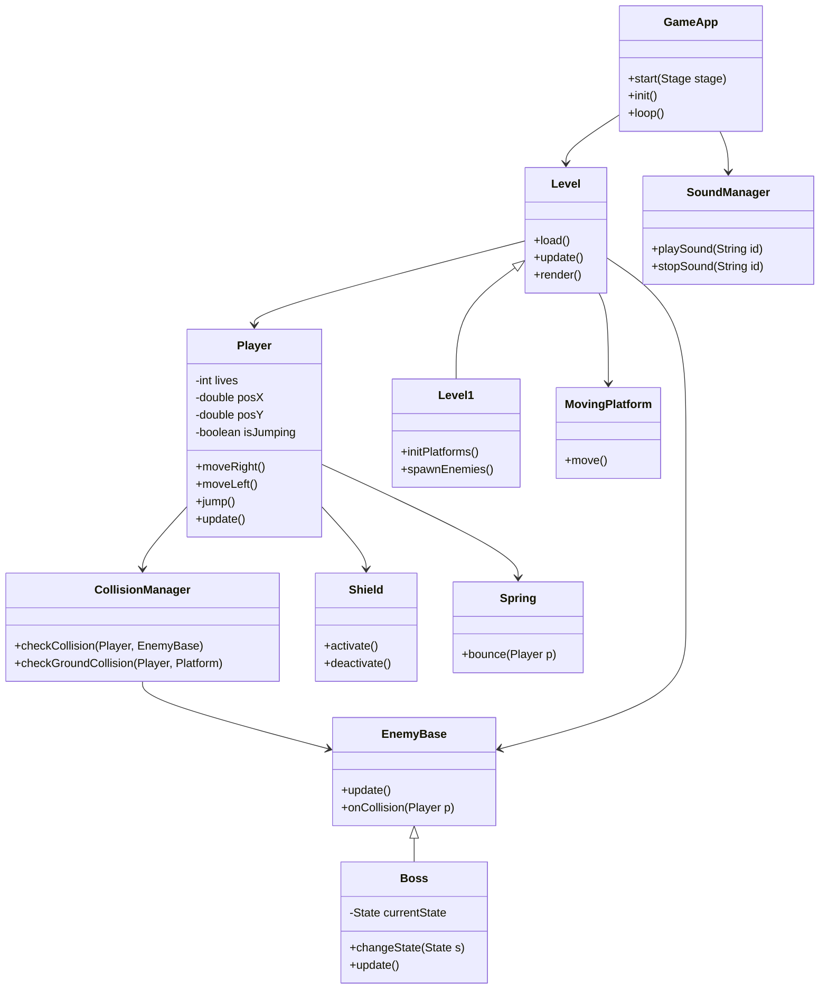

# Relazione di Progetto – SonicX

## 1. Abstract
Il progetto **SonicX** nasce dal desiderio di creare un videogioco 2D ispirato a *Sonic the Hedgehog*, realizzato interamente in **Java** con l’ausilio di **JavaFX** per la grafica e la gestione delle scene.  
L’obiettivo principale è stato quello di progettare e sviluppare un piccolo motore di gioco che comprendesse il **movimento del personaggio principale**, la **gestione dei nemici e delle collisioni**, **livelli progressivi**, **interfacce grafiche** e **effetti sonori**, applicando in modo concreto i principi della **programmazione orientata agli oggetti (OOP)** e della **progettazione UML**.  

Attraverso questo progetto ho potuto mettere in pratica concetti teorici come **ereditarietà, incapsulamento, polimorfismo**, e pattern di design come **State**, **Strategy**, **Singleton** e **Template Method**, costruendo un sistema modulare, flessibile ed estendibile.

## 2. Analisi

### 2.1 Requisiti
**Requisiti funzionali**
- Movimento del personaggio principale (corsa, salto, interazione con molle e piattaforme).
- Gestione di nemici con logiche e pattern differenti.
- Livelli con ostacoli, piattaforme mobili e un boss finale.
- HUD con punteggio, vite e tempo.
- Menu iniziale e interfaccia di gioco.
- Integrazione di musica di sottofondo ed effetti sonori.

**Requisiti non funzionali**
- Portabilità su **Java 8+** e compatibilità con **JavaFX**.
- Architettura modulare e facilmente manutenibile.
- Codice leggibile, documentato e riutilizzabile.
- Buone prestazioni su sistemi standard.

### 2.2 Analisi e modello del dominio
Il dominio del gioco è composto da una serie di entità che interagiscono tra loro:  

- **Player**: il protagonista controllato dall’utente.  
- **EnemyBase / Enemy**: nemici con comportamenti autonomi.  
- **Boss**: nemico principale con macchina a stati e comportamenti multipli.  
- **Shield**: power-up di protezione temporanea.  
- **Spring**: elemento che spinge Sonic verso l’alto (fisica verticale).  
- **MovingPlatform**: piattaforme mobili su assi X/Y.  
- **CollisionManager**: gestore centrale delle collisioni tra entità.  
- **LevelX**: classi dei livelli con logiche e configurazioni proprie.  
- **FinishGate**: punto finale del livello.  

Di seguito riporto lo **schema UML** che rappresenta le principali relazioni tra le classi del progetto:

## 3. Design

### 3.1 Architettura generale
L’architettura del gioco segue un modello **Model–View–Controller** semplificato:

- **Model:** classi di logica e dati (Player, Enemy, Boss, Level, CollisionManager).
- **View:** componenti di rendering grafico e HUD.
- **Controller:** GameApp e InputHandler, che gestiscono il flusso di gioco e gli input da tastiera.

Le **Scene JavaFX** permettono la gestione separata di:
- Menu principale
- Livelli di gioco
- Schermate di vittoria/sconfitta

Ogni parte è isolata, favorendo la manutenibilità e la possibilità di espandere il progetto con nuovi livelli o funzionalità.

### 3.2 Pattern di design utilizzati
- **State:** usato nel Boss e nel Player per rappresentare comportamenti dinamici (idle, salto, attacco, invulnerabilità).
- **Strategy:** per differenziare logiche di movimento o attacco dei nemici.
- **Template Method:** nei vari livelli (Level1, Level2, Level3), che estendono una classe base comune ridefinendo solo parti specifiche.
- **Observer:** l’HUD osserva lo stato del Player per aggiornare dinamicamente vite, punteggio e tempo.
- **Singleton:** applicato al SoundManager per la gestione centralizzata dell’audio.

## 4. Sviluppo

### 4.1 Dettagli implementativi
Durante lo sviluppo ho posto particolare attenzione alla gestione della fisica e alle collisioni:
- Implementazione del **game loop** tramite `AnimationTimer`, che aggiorna costantemente input, logica e rendering.
- Sistema di **collision detection** basato su bounding box con gestione dei diversi tipi di contatto (sopra, laterale, sotto).
- Introduzione di **Timer** per gestire animazioni e invulnerabilità.
- Ottimizzazione dei controlli di input tramite `setOnKeyPressed` e `setOnKeyReleased`.
- Integrazione di **suoni** ed **effetti grafici** sincronizzati con le azioni di gioco.

### 4.2 Testing
Ho sviluppato test di base con **JUnit**, focalizzati soprattutto su:
- corretto funzionamento delle collisioni;
- gestione delle vite e delle condizioni di game over;
- stabilità del game loop in presenza di più entità contemporanee.

## 5. Guida utente
Per avviare il gioco:
1. Verificare di avere **JavaFX configurato** sul proprio IDE o terminale.
2. Eseguire la classe `game.Main`.
3. Dal menu principale premere **INVIO** per iniziare la partita.

**Comandi di gioco**
- Frecce direzionali: movimento a destra/sinistra  
- Spazio: salto  
- Esc: ritorno al menu principale  

**Obiettivo:** completare tutti i livelli raggiungendo il `FinishGate`, evitando nemici e raccogliendo oggetti bonus.

## 6. Considerazioni personali
Questo progetto ha rappresentato per me un percorso di crescita notevole. Ho imparato a progettare un sistema complesso in modo modulare, rispettando i principi della programmazione a oggetti e comprendendo la reale importanza di un buon design software.  

Mi sono occupato personalmente di:
- **Design delle entità principali** e delle loro interazioni;
- **Gestione delle collisioni** e della fisica del movimento;
- **Sviluppo del menu e dell’interfaccia utente**;
- **Integrazione di musica, effetti sonori e HUD dinamico**;
- **Ottimizzazione delle performance** e test di stabilità.

Le principali **difficoltà** sono state la sincronizzazione tra logica e rendering, la gestione simultanea di più collisioni e l’ottimizzazione del frame rate.  
Tuttavia, superare questi ostacoli mi ha permesso di consolidare le mie capacità di analisi e problem solving, oltre a migliorare la mia padronanza di Java e JavaFX.  

In futuro vorrei ampliare il progetto introducendo:
- salvataggi dei progressi;
- power-up avanzati (scudi, super velocità);
- nuovi boss con intelligenze artificiali più complesse;
- una modalità a due giocatori.  

Realizzare **SonicX** è stato per me un esercizio non solo tecnico ma anche creativo: un modo per unire la passione per i videogiochi con la programmazione, trasformando teoria e impegno in un risultato concreto e divertente.
