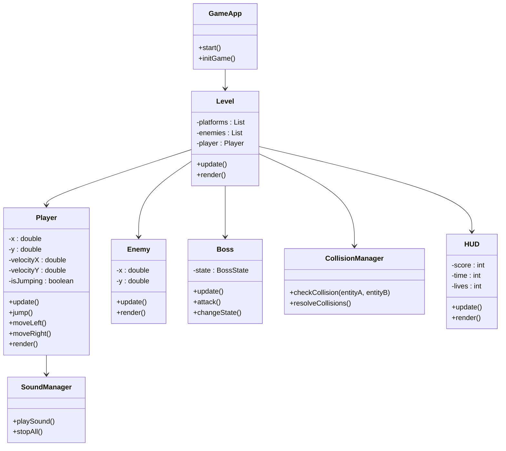
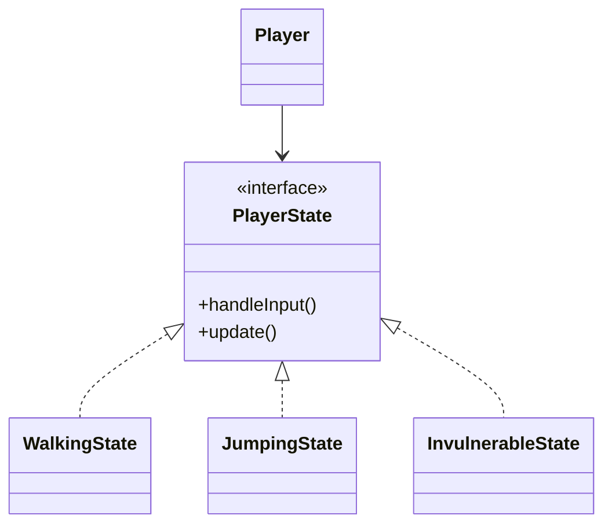

# 🎮 **Relazione di Progetto – SonicX**

---

## 🧩 Introduzione

Il progetto **SonicX** nasce come realizzazione accademica di un videogioco a piattaforme 2D ispirato alla saga di *Sonic the Hedgehog*.  
L’obiettivo principale è unire la **programmazione orientata agli oggetti (OOP)** con la **progettazione di un motore di gioco modulare**, applicando concetti come ereditarietà, polimorfismo, incapsulamento e gestione degli eventi.

Il progetto è stato sviluppato con l’intento non solo di replicare un classico platform, ma di creare un ambiente di sviluppo flessibile e estendibile, capace di integrare nuove meccaniche e livelli con interventi minimi sul codice sorgente.

---

## ⚙️ Analisi

### 🔹 Requisiti funzionali

- Movimento del personaggio principale (corsa, salto, accelerazione, interazione con molle e piattaforme mobili).  
- Gestione delle collisioni con nemici, ostacoli e piattaforme.  
- Implementazione di più livelli con obiettivi e boss finale.  
- Sistema **HUD** con vite, punteggio e tempo.  
- Menu iniziale e schermate di vittoria/sconfitta.  
- Gestione di musica di sottofondo ed effetti sonori.

### 🔹 Requisiti non funzionali

- Portabilità su **Java 11+**.  
- Architettura modulare, leggibile e facilmente estendibile.  
- Rendering stabile e reattivo con **JavaFX**.  
- Esecuzione fluida su PC standard.

### 🔍 Analisi dei Requisiti Estesa

Durante la fase iniziale di progettazione, sono state considerate varie alternative:
- **Motore grafico:** si è scelto JavaFX rispetto a librerie come LWJGL o Swing per la semplicità di integrazione e la compatibilità con i requisiti accademici.  
- **Fisica e collisioni:** è stata adottata una gestione manuale a bounding-box per controllare direttamente le interazioni ed evitare overhead.  
- **Gestione dei livelli:** ogni livello è definito tramite classi specifiche (es. `Level1`, `Level2`) per permettere un’estensione immediata del gioco.  
- **Scalabilità:** il progetto è pensato per accogliere facilmente nuovi elementi (es. power-up, trappole, boss secondari).  

Il risultato è un sistema coerente, leggibile e facilmente mantenibile nel tempo, con un equilibrio tra semplicità e completezza.

---

## 🧱 Modello del Dominio

Il gioco è composto da diverse entità che cooperano per creare l’ambiente interattivo:

| **Entità** | **Descrizione** |
|-------------|-----------------|
| **Player** | Personaggio principale controllato dal giocatore (Sonic). Gestisce movimento, animazioni e fisica. |
| **Enemy / Boss** | Nemici autonomi e boss con stati multipli di comportamento. |
| **Level** | Contiene piattaforme, molle, nemici e logica del livello. |
| **CollisionManager** | Gestisce collisioni e interazioni tra entità. |
| **Spring / MovingPlatform / FinishGate** | Elementi dinamici che influenzano la fisica o segnano la fine del livello. |
| **SoundManager** | Gestisce musica ed effetti sonori. |
| **HUD** | Mostra vite, punteggio e tempo di gioco. |

---

### 🧩 Schema UML del Dominio

---

## 🧠 Design

### 🧩 Architettura generale

L’architettura segue il pattern **Model–View–Controller (MVC)**, adattato al contesto videoludico.

| **Componente** | **Ruolo** |
|-----------------|-----------|
| **Model** | Contiene logica di gioco (entità, collisioni, livelli). |
| **View** | Rendering grafico, HUD e menu (JavaFX). |
| **Controller** | Gestione degli input e del ciclo di gioco (GameApp, InputHandler). |

### 🔧 Approfondimento Architetturale

L’architettura del progetto è stata disegnata per massimizzare la **modularità**.  
Ogni livello, entità o effetto è gestito come modulo indipendente, riducendo le dipendenze e semplificando i test.  
Il ciclo di vita del gioco segue queste fasi principali:

1. **Inizializzazione:** caricamento risorse, musica e oggetti di gioco.  
2. **Esecuzione:** loop principale che aggiorna la logica e renderizza.  
3. **Terminazione:** rilascio delle risorse e chiusura ordinata dell’applicazione.

L’intero sistema si basa su un uso efficiente della memoria e sulla pulizia dei riferimenti ciclici, garantendo stabilità anche in sessioni prolungate.

---

### 🧩 Pattern di Progettazione Utilizzati

| **Pattern** | **Funzione nel progetto** |
|--------------|----------------------------|
| **State / Strategy** | Gestisce gli stati del Player (camminata, salto, invulnerabilità, scudo). |
| **Observer** | L’HUD osserva il Player e aggiorna vite, punteggio e tempo. |
| **Template Method** | I livelli derivano da `Level`, modificando solo le parti specifiche. |
| **Singleton** | `SoundManager` centralizza la gestione audio. |
| **Factory** | Crea dinamicamente entità e livelli. |

#### 📘 Analisi dei Pattern

Ogni pattern è stato scelto per rispondere a una specifica esigenza progettuale:

- **State** → permette di isolare il comportamento del player e di sostituirlo dinamicamente.  
- **Observer** → mantiene sincronizzati HUD e Player senza accoppiamento diretto.  
- **Template Method** → evita la duplicazione di codice tra i diversi livelli.  
- **Singleton** → garantisce l’unicità delle risorse audio durante l’esecuzione.  
- **Factory** → permette l’inizializzazione modulare e ordinata degli oggetti di gioco.  

#### 📘 Schema UML – Pattern State

---

## ⚙️ Analisi delle Prestazioni e Ottimizzazioni

L’ottimizzazione delle prestazioni è stata affrontata sin dalle prime fasi di sviluppo:

- **Gestione memoria:** caricamento lazy delle risorse grafiche e audio.  
- **Rendering:** batch update per ridurre il numero di operazioni grafiche per frame.  
- **Collisioni:** controlli a griglia e bounding-box per limitare i calcoli superflui.  
- **Audio:** riproduzione asincrona in thread separato per ridurre la latenza.  
- **Frame rate:** testato stabile a 60 FPS su macchine di fascia media.  

Queste scelte hanno garantito una buona efficienza e una giocabilità fluida anche in livelli con molti elementi attivi.

---

## 🧭 Commenti finali

### ✅ Autovalutazione

Mi sono occupato personalmente di:
- Architettura generale del progetto e organizzazione dei pacchetti.  
- Gestione collisioni, movimento e fisica.  
- Creazione dei livelli e dell’HUD.  
- Integrazione dell’audio e del menu principale.  

**Punti di forza**
- Architettura modulare e leggibile.  
- Codice riutilizzabile e commentato.  
- Gameplay fluido e coerente.  

**Punti da migliorare**
- Ottimizzazione del caricamento iniziale.  
- Maggiore test coverage.  
- Miglior separazione logica/grafica.  

---

### 🚀 Sviluppi futuri

- Aggiunta di **power-up** (scudi, invincibilità, velocità).  
- Implementazione del **salvataggio progressi** e punteggio globale.  
- Miglioramento della fisica (pendenze, attrito realistico).  
- Introduzione di nuovi **livelli** e modalità “Boss Rush”.  

---

### ⚠️ Difficoltà riscontrate

- Gestione precisa delle collisioni multiple.  
- Sincronizzazione tra thread di logica e thread grafico JavaFX.  
- Integrazione fluida di musica/effetti senza perdita di frame.  
- Ottimizzazione del frame rate e del caricamento delle risorse.  

---

## 🧠 Riflessione Personale

Questo progetto ha rappresentato un’importante occasione di crescita personale e tecnica.  
Sviluppare **SonicX** mi ha permesso di comprendere a fondo la complessità di un videogioco: dal coordinamento tra fisica e grafica, alla gestione efficiente della memoria, fino alla creazione di un codice realmente riutilizzabile.  

Ogni difficoltà ha rafforzato la mia capacità di analisi e problem solving, avvicinandomi al modo di pensare tipico dello sviluppo software professionale.  
Il progetto costituisce oggi una base solida da cui partire per realizzare versioni più evolute e sperimentali.

---

## 🧾 Conclusioni

Il progetto **SonicX** rappresenta un esempio concreto di applicazione dei principi OOP e dei pattern di progettazione in un contesto videoludico.  
L’architettura modulare, la gestione del ciclo di gioco e l’integrazione con JavaFX mostrano come teoria e pratica possano convergere in un risultato coerente, dinamico e accademicamente valido.
