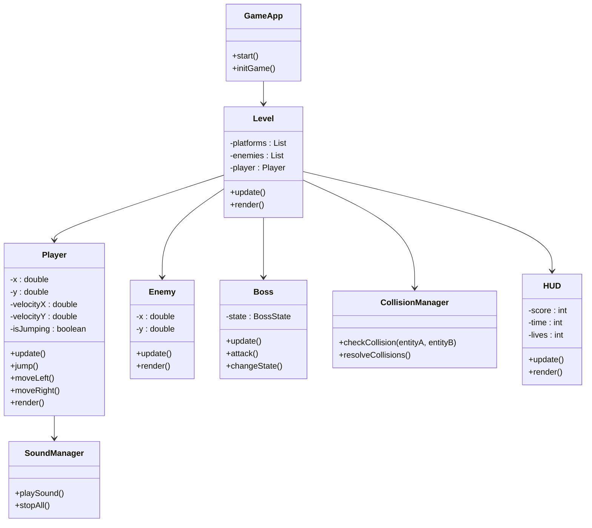
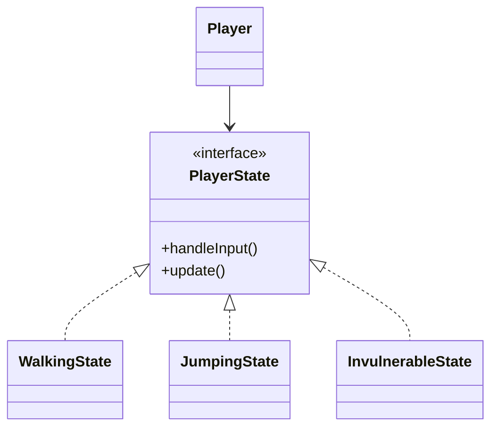

# 🎮 **Relazione di Progetto – SonicX**

---

## 🧩 Introduzione

Il progetto **SonicX** nasce come realizzazione accademica di un videogioco a piattaforme 2D ispirato alla saga di *Sonic the Hedgehog*.  
L’obiettivo principale è unire la **programmazione orientata agli oggetti (OOP)** con la **progettazione di un motore di gioco modulare**, applicando concetti come ereditarietà, polimorfismo, incapsulamento e gestione degli eventi.

---

## ⚙️ Analisi

### 🔹 Requisiti funzionali

- Movimento del personaggio principale (corsa, salto, accelerazione, interazione con molle e piattaforme mobili).  
- Gestione delle collisioni con nemici, ostacoli e piattaforme.  
- Implementazione di più livelli con obiettivi e boss finale.  
- Sistema **HUD** con vite, punteggio e tempo.  
- Menu iniziale e schermate di vittoria/sconfitta.  
- Gestione di musica di sottofondo ed effetti sonori.

### 🔹 Requisiti non funzionali

- Portabilità su **Java 11+**.  
- Architettura modulare, leggibile e facilmente estendibile.  
- Rendering stabile e reattivo con **JavaFX**.  
- Esecuzione fluida su PC standard.

---

## 🧱 Modello del Dominio

Il gioco è composto da diverse entità che cooperano per creare l’ambiente interattivo:

| **Entità** | **Descrizione** |
|-------------|-----------------|
| **Player** | Personaggio principale controllato dal giocatore (Sonic). Gestisce movimento, animazioni e fisica. |
| **Enemy / Boss** | Nemici autonomi e boss con stati multipli di comportamento. |
| **Level** | Contiene piattaforme, molle, nemici e logica del livello. |
| **CollisionManager** | Gestisce collisioni e interazioni tra entità. |
| **Spring / MovingPlatform / FinishGate** | Elementi dinamici che influenzano la fisica o segnano la fine del livello. |
| **SoundManager** | Gestisce musica ed effetti sonori. |
| **HUD** | Mostra vite, punteggio e tempo di gioco. |

---

### 🧩 Schema UML del Dominio



---

## 🧠 Design

### 🧩 Architettura generale

L’architettura segue il pattern **Model–View–Controller (MVC)**, adattato al contesto videoludico.

| **Componente** | **Ruolo** |
|-----------------|-----------|
| **Model** | Contiene logica di gioco (entità, collisioni, livelli). |
| **View** | Rendering grafico, HUD e menu (JavaFX). |
| **Controller** | Gestione degli input e del ciclo di gioco (GameApp, InputHandler). |

**Ciclo di gioco (`Game Loop`)**

1. **Input:** lettura dei comandi da tastiera.  
2. **Update:** aggiornamento della logica, fisica e collisioni.  
3. **Render:** disegno a schermo degli elementi grafici.

Questa struttura garantisce fluidità e sincronizzazione costante.

---

### 🧩 Pattern di Progettazione Utilizzati

| **Pattern** | **Funzione nel progetto** |
|--------------|----------------------------|
| **State / Strategy** | Gestisce gli stati del Player (camminata, salto, invulnerabilità, scudo). |
| **Observer** | L’HUD osserva il Player e aggiorna vite, punteggio e tempo. |
| **Template Method** | I livelli derivano da `Level`, modificando solo le parti specifiche. |
| **Singleton** | `SoundManager` centralizza la gestione audio. |
| **Factory** | Crea dinamicamente entità e livelli. |

#### 📘 Schema UML – Pattern State



---

## 🧪 Sviluppo e Testing

### 🧾 Testing automatizzato

È stato realizzato un sistema di test **JUnit** per verificare la correttezza logica delle principali componenti:

- **CollisionManager** → rilevamento e risoluzione delle collisioni.  
- **Player** → gestione del salto, danni e interazione con molle.  
- **HUD** → aggiornamento coerente di vite e punteggio.  
- **SoundManager** → caricamento e riproduzione corretta dei suoni.  

---

### 🧱 Note di sviluppo

- Uso di `enum Axis` per definire direzioni di movimento delle piattaforme.  
- Metodo `bounceOnSpring()` per la fisica elastica delle molle.  
- Timer JavaFX per animazioni e invulnerabilità temporanea.  
- `RandomUtil` per spawn casuale di nemici e bonus.  
- Audio gestito in modo asincrono per evitare lag.  
- Separazione netta tra **logica** e **grafica**.

---

## 🧭 Commenti finali

### ✅ Autovalutazione

Mi sono occupato personalmente di:
- Architettura generale del progetto e organizzazione dei pacchetti.  
- Gestione collisioni, movimento e fisica.  
- Creazione dei livelli e dell’HUD.  
- Integrazione dell’audio e del menu principale.  

**Punti di forza**
- Architettura modulare e leggibile.  
- Codice riutilizzabile e commentato.  
- Gameplay fluido e coerente.  

**Punti da migliorare**
- Ottimizzazione del caricamento iniziale.  
- Maggiore test coverage.  
- Miglior separazione logica/grafica.  

---

### 🚀 Sviluppi futuri

- Aggiunta di **power-up** (scudi, invincibilità, velocità).  
- Implementazione del **salvataggio progressi** e punteggio globale.  
- Miglioramento della fisica (pendenze, attrito realistico).  
- Introduzione di nuovi **livelli** e modalità “Boss Rush”.  

---

### ⚠️ Difficoltà riscontrate

- Gestione precisa delle collisioni multiple.  
- Sincronizzazione tra thread di logica e thread grafico JavaFX.  
- Integrazione fluida di musica/effetti senza perdita di frame.  
- Ottimizzazione del frame rate e del caricamento delle risorse.  

---

## 🎮 Guida Utente

### ▶️ Avvio del gioco

Per avviare il gioco, eseguire la classe principale:

```bash
java GameApp
```

oppure da IDE:

> Eseguire `game.Main` o `GameApp.java` con **JavaFX** configurato.

### ⌨️ Comandi

| **Tasto** | **Azione** |
|------------|-------------|
| ← / → | Muove Sonic a sinistra o destra |
| Spazio | Salta |
| Invio (Enter) | Avvia la partita |
| Esc | Torna al menu principale |

### 🎯 Obiettivo

Raggiungere la **FinishGate** di ogni livello evitando nemici e raccogliendo anelli.  
Il gioco termina in caso di perdita di tutte le vite o vittoria contro il boss finale.

---

## 🧾 Conclusioni

Il progetto **SonicX** rappresenta un esempio concreto di applicazione dei principi OOP e dei pattern di progettazione in un contesto videoludico.  
L’architettura modulare, la gestione del ciclo di gioco e l’integrazione con JavaFX mostrano come teoria e pratica possano convergere in un risultato coerente, dinamico e accademicamente valido.
